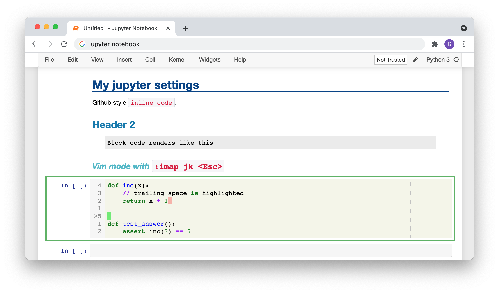

# My custom jupyter notebook settings



In Jupyter Command mode:
* default shortcuts e.g. `j`/`k` to move down/up, `a`/`b` to insert cell above/below
* `e,e` to clear current cell's output
* `t` and `T` to toggle header and toolbar

In Jupyter Edit mode:
* vim bindings
* `:imap jk <Esc>`
* `/` for search within cell
* `:` command mode for search-and-replace eg `:s/foo/bar/g`
* `CTRL-K` to select cell below (like tmux)
* `CTRL-J` to select cell below (like tmux)
* `CTLR-/` to toggle comment

Styling:
* Relative line number (press `l` in Jupyter Command mode to toggle)
* Ruler at 80 characters
* Highlight trailing white space
* Simple tweaks to css for headers and inline- and block-code

## Install

Code snippets below are just examples. You should cherry-pick the parts you need to fit your own needs.

### Jupyter server on your localhost

The default location for custom settings are at `~/.jupyter` (To see where it is on your system, run: `jupyter --paths`)
```
cd ~
mv .jupyter .jupyterbackup
git clone https://github.com/gshiba/jupyter-notebook-extension.git .jupyter
mkdir -p .config/jupytext
ln -f -r -s .jupyter/jupytext.toml .config/jupytext/jupytext.toml
cd /path/to/my/notebooks-dir
jupyter notebook
```

### Jupyter server in a docker container

```
cd /path/to/my/notebooks-dir
git clone https://github.com/gshiba/jupyter-notebook-extension.git
docker run --rm -it  \
    -p 8888:8888  \
    -v ${PWD}:/home/jovyan/work  \
    -v ${PWD}/jupyter-notebook-extension:/home/jovyan/.jupyter  \
    jupyter/datascience-notebook  \
    start-notebook.sh  \
    --NotebookApp.password='${SHA1}' \
    --ip=0.0.0.0
```
For `${SHA1}` see: https://jupyter-notebook.readthedocs.io/en/stable/public_server.html


## Credits

The code in this repo is mostly lifed from various extensions in the 
[ipython-contrib/jupyter_contrib_nbextensions](https://github.com/ipython-contrib/jupyter_contrib_nbextensions) repo.
I used to rely on it to set up the various tweaks, but its activity has mostly
died down due to the community moving to Jupyter Lab.
